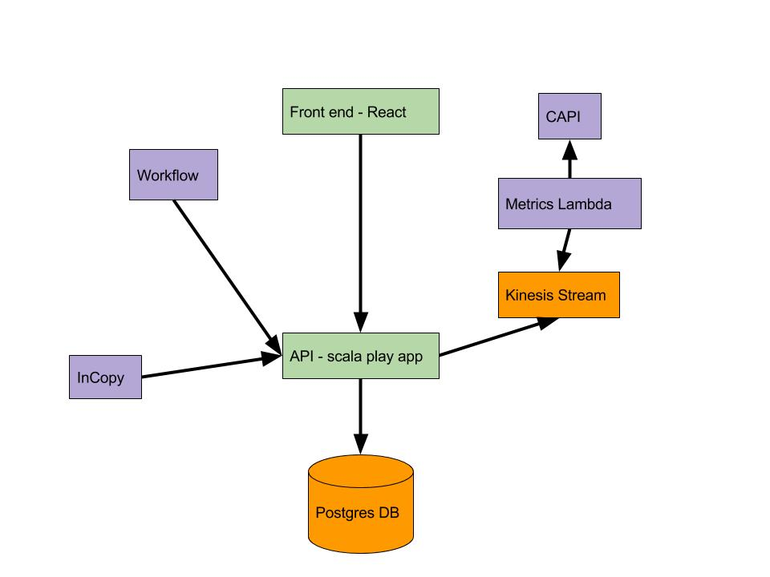

# Architecture

The app is a scala play app with a react frontend and a RDS postgres database.

Data is collected from InCopy and Workflow by the apps making POST requests

The app also listens to a kinesis stream. This stream is posted to by a [lambda](https://github.com/guardian/production-metrics-lambdas) which is querying CAPI once a day